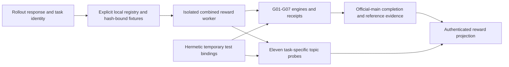

# Fixed26 results

## Reference evaluations

| Result | Pass@1 | Multi turn with feedback (turn=2) | Trials | Samples |
| --- | ---: | ---: | ---: | ---: |
| [GLM-4.7-Flash base](results/base-fixed26-20260711/) | 0.5/26 mean | 4.5/26 mean | 4 | 104 |
| [Luna](results/luna-fixed26-20260805/) | 6.25/26 mean | 16.75/26 mean | 4 | 104 |

| Result | Pass@1 SD, range, 95% CI (out of 26) | Multi turn with feedback (turn=2) SD, range, 95% CI (out of 26) | Conditional turn-2 recovery |
| --- | --- | --- | ---: |
| GLM-4.7-Flash base | 0.58; 0-1; 0-1.25 | 1.29; 3-6; 2.25-6.75 | 16/102 (15.7%; CI 7.8-24.8%) |
| Luna | 1.89; 5-9; 3.25-9.5 | 1.5; 15-18; 12.75-20.5 | 42/79 (53.2%; CI 36.8-70%) |

## Post-training evaluations

| Result | Pass@1 | Multi turn with feedback (turn=2) | Trials | Samples |
| --- | ---: | ---: | ---: | ---: |
| [SFT v5, Aider-format](results/sft-v5-aiderfmt-1117-4trials/) | 6/26 mean | 10.25/26 mean | 4 | 104 |
| [Synth v1, epoch 50](results/synth-v1-ep50-9.5-mean/) | 9.5/26 mean | 12/26 mean | 4 | 104 |
| [execution-midband-RL-v1](https://huggingface.co/TokenBender/glm47-bank-account-official-grpo20) | 8.25/26 mean | 13/26 mean | 4 | 104 |
| [execution-midband-RL-v2](https://huggingface.co/TokenBender/execution-midband-RL-v2) | 10.5/26 mean | 14.5/26 mean | 4 | 104 |
| [Phone Number kernel12 GRPO20, iter 14](results/phone-number-kernel12-GRPO20/) | 11.25/26 mean | 15.25/26 mean | 4 | 104 |
| [Generalized C++ kernel GRPO20, iter 14](https://huggingface.co/WootzappLab/generalized-cpp-kernel-GRPO20/tree/269560b1f4d6471a1726dd7a95712ef4e3da0838) | 11.75/26 mean | 16/26 mean | 4 | 104 |

| Result | Pass@1 SD, range, 95% CI (out of 26) | Multi turn with feedback (turn=2) SD, range, 95% CI (out of 26) | Conditional turn-2 recovery |
| --- | --- | --- | ---: |
| SFT v5, Aider-format | 1.63; 4-8; 3-9.25 | 1.71; 8-12; 7-13.75 | 17/80 (21.2%; CI 11.9-31.6%) |
| Synth v1, epoch 50 | 0.58; 9-10; 5.75-13.5 | 0.82; 11-13; 8.25-15.75 | 10/66 (15.2%; CI 7.4-24.4%) |
| execution-midband-RL-v1 | 2.06; 6-11; 4.75-12 | 0.82; 12-14; 9-17 | 19/71 (26.8%; CI 14.5-41.4%) |
| execution-midband-RL-v2 | 1.29; 9-12; 7-14 | 2.08; 12-17; 10.5-18.5 | 16/62 (25.8%; CI 12.9-41.9%) |
| Phone Number kernel12 GRPO20, iter 14 | 0.5; 11-12; 7.5-15 | 0.5; 15-16; 11-19.25 | 16/59 (27.1%; CI 13.1-44.2%) |
| Generalized C++ kernel GRPO20, iter 14 | 1.50; 10-13; 8-15.5 | 1.41; 14-17; 11.75-20 | 17/57 (29.8%; CI 14.5-48.9%) |

Statistics: [method and summary](results/statistics.md) · [per-task frequencies](results/per_task_success.csv) · [recompute](results/compute_statistics.py)

SFT v5 artifacts: [checkpoint](https://huggingface.co/TokenBender/glm47-aider-sft-v5-aiderfmt-1117-3ep/tree/5d06951941a30939920fb2b7558aa95085531d52) · [training dataset](https://huggingface.co/datasets/TokenBender/glm47-aider-posttraining-data/blob/6ef50c6fd1aca637c3df2df00c9aab4120140797/datasets/aiderfmt-api-contracts-20260727/sft/sft-v5-aiderfmt-1117-api-contracts.jsonl) · [evaluation evidence](https://huggingface.co/datasets/WootzappLab/glm47-aider-fixed26-responses/tree/b47e31f014c4128cad19d625317229637f337996/evals/sft-v5-aiderfmt-1117-fixed26contract-pass8-20260727)

Synth v1 artifacts: [reproducibility bundle](https://huggingface.co/TokenBender/glm47-synth-v1-reproducibility) · [checkpoint archive](https://huggingface.co/TokenBender/glm47-synth-v1-100ep) · [training dataset](https://huggingface.co/datasets/WootzappLab/glm47-synth-v1-dataset/tree/face23163ca2e9c27f2506b8c757af6ed666dfb7) · [evaluation archive](https://huggingface.co/datasets/WootzappLab/glm47-synth-v1-fixed26-evals/tree/ec8b93b8f5916f81b9fecdc9f55960919ef92e2e) · [W&B run](https://wandb.ai/ahm-rimer/glm47-aider-cpp-sft/runs/glm47-synth-memorization-v1-100ep-20260731T071000Z)

The evaluation archives require authorized WootzappLab HF access and remain
evaluation-only. Their payloads are unchanged; historical result manifests and
the hash-bound failure-coverage ledger retain their source identities.
The SFT v5 training-dataset URL records historical provenance: its URL/hash mapping
remains unverified and must not be treated as a verified current download.

execution-midband-RL-v1 artifacts: [run archive](https://huggingface.co/TokenBender/glm47-bank-account-official-grpo20) · [final adapter](https://huggingface.co/TokenBender/glm47-bank-account-official-grpo20/tree/main/runs/issue111-bank-official-grpo20-20260817T151213Z/checkpoints/grpo_lora_r16/iter_0000019/adapter) · [evaluation evidence](https://huggingface.co/TokenBender/glm47-bank-account-official-grpo20/tree/main/fixed26-evaluations/issue111-grpo20-iter19-fixed26-mt2-suite-20260817T193037Z) · [evaluation method](results/execution-midband-rl-v1/method/)

execution-midband-RL-v2 artifacts: [run archive](https://huggingface.co/TokenBender/execution-midband-RL-v2) · [final adapter](https://huggingface.co/TokenBender/execution-midband-RL-v2/tree/main/execution-bank-RL-v2-think-r2/checkpoints/grpo_lora_r16/iter_0000019/adapter) · [evaluation evidence](https://huggingface.co/TokenBender/execution-midband-RL-v2/tree/main/execution-bank-RL-v2-think-r2/fixed26-mt2-4x-20260818) · [evaluation method](results/execution-midband-rl-v2/method/) · [launch configurations](results/execution-midband-rl-v2/launch-configs/) · [W&B run](https://wandb.ai/ahm-rimer/execution-bank-RL-v2-think/runs/execution-bank-RL-v2-think-r2)

Phone Number kernel12 GRPO20 artifacts: [run archive](https://huggingface.co/WootzappLab/phone-number-kernel12-GRPO20/tree/adf419fcb32baa335d80c3d9a96c618f3f286a14) · [scored adapter](https://huggingface.co/WootzappLab/phone-number-kernel12-GRPO20/tree/adf419fcb32baa335d80c3d9a96c618f3f286a14/checkpoints/iter_0000014/adapter) · [training dataset](https://huggingface.co/WootzappLab/phone-number-kernel12-GRPO20/blob/adf419fcb32baa335d80c3d9a96c618f3f286a14/Phone_Number_train.jsonl) · [evaluation evidence](results/phone-number-kernel12-GRPO20/trials/) · [evaluation method](results/phone-number-kernel12-GRPO20/method/) · [launch configurations](results/phone-number-kernel12-GRPO20/launch-configs/) · [W&B run](https://wandb.ai/models-iit-bhu-news/glm47-phone-number-dnd-grpo/runs/phone-number-kernel12-grpo20-spot-20260822-102653)

Generalized C++ kernel GRPO20 artifacts: [run archive](https://huggingface.co/WootzappLab/generalized-cpp-kernel-GRPO20/tree/269560b1f4d6471a1726dd7a95712ef4e3da0838) · [scored adapter, iter 14](https://huggingface.co/WootzappLab/generalized-cpp-kernel-GRPO20/tree/269560b1f4d6471a1726dd7a95712ef4e3da0838/checkpoints/iter_0000014/adapter) · [training dataset](https://huggingface.co/WootzappLab/generalized-cpp-kernel-GRPO20/blob/269560b1f4d6471a1726dd7a95712ef4e3da0838/Generalized_CPP_GRPO20_train.jsonl) · [evaluation evidence](https://huggingface.co/WootzappLab/generalized-cpp-kernel-GRPO20/tree/269560b1f4d6471a1726dd7a95712ef4e3da0838/evaluations/iter14-fixed26-mt2-best4-20260902) · [W&B run](https://wandb.ai/himanshu2725pathak-wootzapp/glm47-generalized-cpp-grpo/runs/generalized-cpp-kernel-grpo20-spot-20260829-083214-retry1)

Generalized C++ result boundary: this row uses four selected, receipt-verified `fixed26-contract-v2` trials. It is an assisted regression result, not a random four-trial or pristine held-out benchmark claim; six training task IDs overlap Fixed26.

## Current artifact locations (reference artifacts only)

The Wootzapp-owned copies below resolve under the existing authenticated HF
session and require authorized access. They are not new runtime dependencies of
this verifier PR. Current navigation links use the verified Wootzapp revisions;
historical manifests, W&B runs and local result archives retain their provenance.
Their reported scores are not results of this candidate tree. Unmigrated private
artifacts retain their original links; access is not established by this PR.

| Artifact | Repository type | Role |
|---|---|---|
| [glm47-synth-v1-dataset](https://huggingface.co/datasets/WootzappLab/glm47-synth-v1-dataset) | dataset | Shared SFT/reference data |
| [glm47-aider-posttraining-data](https://huggingface.co/datasets/WootzappLab/glm47-aider-posttraining-data) | dataset | Shared post-training catalog |
| [phone-number-kernel12-GRPO20](https://huggingface.co/WootzappLab/phone-number-kernel12-GRPO20) | model | PEFT artifact; not an HF dataset |
| [generalized-cpp-kernel-GRPO20](https://huggingface.co/WootzappLab/generalized-cpp-kernel-GRPO20) | model | Generalized C++ PEFT release artifact |

Repository resolution is not a new model-content, training or evaluation run.
The generalized verifier reward adapter still consumes explicit local task
bindings; no HF fallback is introduced for that path.

### PIE dataset and adapter downloads

The PIE downloader uses the pinned Wootzapp repositories below, with unchanged
payloads and LFS objects. Use `hf auth login` with access to these private assets.
Modal requires equivalent access through its existing `huggingface-token` secret;
local checks do not verify the deployed secret.

| Downloader selector | Repository | Default revision |
|---|---|---|
| `data` (dataset) | [WootzappLab/glm47-pie-cpp-posttraining-data](https://huggingface.co/datasets/WootzappLab/glm47-pie-cpp-posttraining-data) | `35b4af63803b2ac906aa8a69178048c366394499` |
| `sft` | [WootzappLab/glm47-flash-pie-cpp-lora-r16-sft-h100](https://huggingface.co/WootzappLab/glm47-flash-pie-cpp-lora-r16-sft-h100) | `c877295dd577afb680d19bc9d9aea5ec99e7587c` |
| `grpo` | [WootzappLab/glm47-flash-pie-cpp-lora-r16-grpo-h100](https://huggingface.co/WootzappLab/glm47-flash-pie-cpp-lora-r16-grpo-h100) | `6799626af220e128c88dab8539f1baeb8aadb572` |

```bash
hf auth whoami
uv run python scripts/download_assets.py data
uv run python scripts/download_assets.py sft
uv run python scripts/download_assets.py grpo
```

These commands download and verify `SHA256SUMS`; they do not launch training.
The dataset extracts 9,146 task JSONs under `data/tasks` in the assets root.
SFT is the generic PIE GRPO warm start; the GRPO adapter is a checkpoint archive,
not the default warm start. `GLM47_DATA_REVISION`, `GLM47_SFT_REVISION` and
`GLM47_GRPO_REVISION` override revisions, not repository IDs or local layouts.

`all` includes the migrated `data`, `sft`, and `grpo` assets. Modal
`prepare_assets` also requests `aider-shadow`. That selector still resolves the
deprecated shadow payload and has **not** been switched to the canonical runtime
package: its compatibility gate is blocked, so complete Modal preparation is not
claimed ready.

The canonical [WootzappLab/glm47-aider-cpp-rl-tasks](https://huggingface.co/datasets/WootzappLab/glm47-aider-cpp-rl-tasks/tree/11864385ca9808b555f6d3fbe306aafca9f1dbd5)
is migrated byte-for-byte and private. At revision
`11864385ca9808b555f6d3fbe306aafca9f1dbd5`, its archive is
`aider-cpp-rl-runtime.tar.gz`, extraction root is `aider_cpp_rl_tasks`, and source
manifest kind is `aider-cpp-rl-rubrics`; these differ from the old downloader's
shadow contract. More importantly, all 253 tasks fail the current loader's
`source_prompt_sha256` check against their packaged `.docs/instructions.md`.
Archive, task-tree and all hidden-test hashes match. All 253 rubric hashes instead
match the original full source prompts, including editable-file listings, in the
preserved candidate catalog. The July packager did not check instruction-byte
hashes; the August validator added that check. No authoritative export/reconstruction
contract was found to bind those source prompts to this runtime package.
Activation requires that publisher contract, then loader and Modal path updates.
Do not bypass validation or substitute evaluation data.

## Generalized and targeted C++ verifier layers

In plain language, G01-G07 remain the seven broad verifiers used across C++
tasks. This change adds one targeted midband layer containing 11 task-specific
semantic verifiers. Nine cover the original midband set: allergies, bank
account, circular buffer, complex numbers, D&D character, grade school, perfect
numbers, space age, and sublist. Clock and yacht were added afterward because
the September evaluations had low Pass@1 but high MEF on those problems.

`generalized_verifier_docs/` contains the seven standalone engines used by
the generalized verifier policy. They derive task details from CLI inputs;
they do not contain task-name-specific scoring rules.

The GRPO reward runs these engines through the production wrappers under
`Reward_GRPO/Generalized Cpp Verifiers/verifiers/` and composes their result
with `Reward_GRPO/generalized_cpp_topic_grpo.py`. The targeted layer covers
allergies, bank account, circular buffer, clock, complex numbers, D&D character,
grade school, perfect numbers, space age, sublist, and yacht. Each task has a
separate behavioral probe under `Reward_GRPO/topic_coverage/probes/`; circular
buffer also has an auxiliary translation-unit probe.

The adapters expect the authenticated task registry, manifests, admission
evidence, and trusted C++ fixtures to be staged at their existing
`Reward_GRPO/` paths before building the sandbox image. Those generated or
run-bound assets are intentionally excluded from this verifier-code review.

| Policy | Engine | Check |
| --- | --- | --- |
| G01 | `01_structural_api_gate.py` | API symbols and declaration shape derived from the official test |
| G02 | `03_two_stage_build_verifier.py` | Candidate compile, test compile, and attributable linker failures |
| G03 | `04_differential_semantic_verifier.py` | Healthy reference control, official test completion, and diagnostic assertion progress |
| G04 | `05_response_integrity_verifier.py` | Empty, looping, or truncated model responses |
| G05 | `06_candidate_boundary_verifier.py` | Whole-file parsing and editable-file boundaries |
| G06 | `07_warning_hygiene_classifier.py` | Compiler diagnostic classes and repair guidance |
| G07 | `08_safety_sanitizer_verifier.py` | ASan/UBSan findings without duplicating build or functional penalties |

The standalone engines use Python's standard library. Their C++ checks need
Linux, a C++17 compiler (`g++` by default, or `$CXX`), a GNU-compatible ELF
linker supporting `--wrap=main`, and working ASan/UBSan runtimes. These machine
prerequisites are separate from this verifier PR.

G03 wraps the official test entry point and checks its return through a separate
completion pipe, together with the process exit and a healthy reference control.
An early exit or a printed Catch2 success summary alone cannot establish PASS.
Assertion counts remain untrusted diagnostic/partial-credit data; failed scores
are never rounded to full correctness. This completion check is not a security
boundary against arbitrary native code in the same process. Hostile candidate
execution still needs the worker/container isolation described below.

Every engine supports `--json` and `--receipt DIR`. Receipt hashes bind artifacts
and identity; they do not authenticate candidate-generated test summaries.
Compiler/tool invocation failures and runtime launch failures produce INVALID
with diagnostics. Runtime INVALID requires OS/launcher evidence; candidate-written
loader or resource-error phrases remain diagnostics and cannot override completed
failures, crashes, timeouts, or early exits. A broken reference invalidates the
differential result. Candidate compile/link failures remain separately attributed.

On a G03 timeout, the verifier kills the process group, drains output for at most
250 ms, then closes the read pipe and allows at most 250 ms to reap the direct
child. Receipts retain collected output and flags for drain/reap deadline expiry.
An escaped descendant holding stdout/stderr cannot make cleanup wait for EOF
indefinitely; containing escaped processes still requires worker isolation.

There are three local validation layers:

```bash
python3 -B generalized_verifier_docs/validation/self_check.py
PYTHONPATH=src:. python3 -B Reward_GRPO/topic_coverage/self_check.py
PYTHONPATH=src:. python3 -B -m pytest -q -p no:cacheprovider tests/test_generalized_cpp_reward_reliability.py
```

The first runs small synthetic positive/negative controls through G01–G07 and
checks receipts. It does not validate all benchmark tasks or the staged fixture
bundle. The second checks the eleven topic definitions, probe inventory and
fixed reward-family denominators; it does not compile or execute those probes.
The reliability suite runs synthetic C++ cases and mocked worker/tool failures,
including cancellation, retries, evidence retention, G03 completion, exact-count
forgery through wrapper/receipt/aggregation/reward, runtime-text precedence, bounded
descendant-held pipe cleanup, and G07 schema/runtime agreement. It does not require Docker or launch training.

Reliability tests require Python 3.10+, the repository's Python dependencies
(including `pydantic`), `pytest>=8` and `jsonschema>=4.18`. In an isolated Python
environment, install them with:

```bash
uv sync --extra dev
uv run --extra dev pytest -q
PYTHONPATH=src:. python3 -B -m pytest -q -p no:cacheprovider tests
python3 -m compileall src tests
```

Full fixture verification and combined-reward preflight additionally require the
externally staged registry, manifests, admission records and fixture bundle,
with matching digests, plus the verifier Docker environment. Local synthetic
checks do not establish that these external assets are available or compatible.
The combined CLI offers worker, image build, data preparation and preflight
commands. Launch staging is deferred; this PR does not supply training launch
or CHARM assets.

The default pytest suite uses temporary synthetic bindings and bounded test-only
reference source strings, not an installed production task pool. Four
`staged_assets` tests retain release-specific 16-train/4-heldout/admission/D&D
checks and are visibly **deselected** unless a registry is explicitly supplied:

```bash
uv run --extra dev pytest -c pyproject.toml -m staged_assets \
  --staged-verifier-registry /secure/staged/Reward_GRPO/generalized_cpp_grpo_registry.json \
  --staged-verifier-root /secure/staged
```

The registry directory must contain the matching manifests, fixtures, admission
document and mutation controls at their declared relative paths. Receipt paths
inside the admission document are instead relative to `--staged-verifier-root`
(for example `/secure/staged/Reward_GRPO/generalized_cpp_grpo_evidence/...`).
Both options are required for staged tests; no implicit candidate-root fallback
is used. The test harness redirects the receipt root only during synchronous
admission validation, retaining all path, SHA-256 and outcome checks. Verifier
and engine execution still uses this checkout, not code from the staged bundle.
These test-only bindings do not change production/default CLI resolution:
`python3 -m Reward_GRPO.generalized_cpp_grpo preflight` still requires the bundle
at the checkout's original `Reward_GRPO/` paths. Use the staged preflight test
above when that bundle is external; it calls the same candidate preflight.
Neither command launches training. Failure to provide those inputs is not
evidence that production preflight passed. The CPU-only torch dev dependency
supports the restored BASE
training-gate tests; no GPU runtime is installed by that dependency.



Each engine also provides `--help` with its task-independent input contract.

## How to reproduce

```bash
cd results/base-fixed26-20260711/reproduction
export OPENAI_API_BASE=http://127.0.0.1:8000/v1
export OPENAI_API_KEY=local-eval
./run.sh
```

```bash
cd results/luna-fixed26-20260805/reproduction
export OPENROUTER_API_KEY=...
./run.sh
```

```bash
cd results/sft-v5-aiderfmt-1117-4trials/reproduction
./run.sh
```

```bash
cd results/synth-v1-ep50-9.5-mean/reproduction
./run.sh
```

```bash
modal run results/execution-midband-rl-v1/method/aider_eval_app.py --parallel \
  --adapter-path /runs/issue111-bank-official-grpo20-20260817T151213Z/checkpoints/grpo_lora_r16/iter_0000019/adapter \
  --expected-adapter-sha256 186b0fc5b200fb8bb55bf85ee4416f2682a470580f0231c6f3f2a4d414bd898e \
  --expected-data-manifest-sha256 b9c80354d4d05123f8a3768898379ff215251fdf3444e6e0f05d52b02b968299 \
  --run-id <fresh-fixed26-run-id>
```

```bash
sky launch -y -c fixed26-mt2-v2 results/execution-midband-rl-v2/method/skypilot-task.yaml
```

```bash
sky jobs launch -y \
  --env EVAL_RUN_ID=<fresh-fixed26-run-id> \
  results/phone-number-kernel12-GRPO20/launch-configs/fixed26-eval.yaml
```
